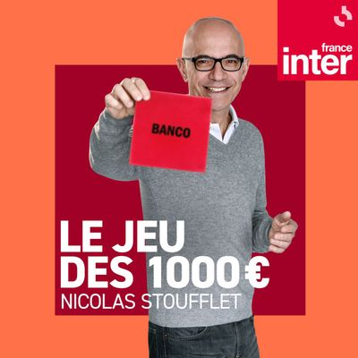
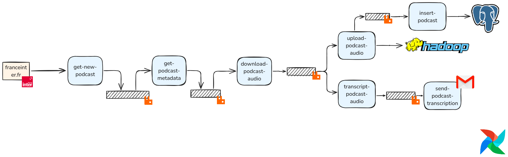

# ETL-1000euros
Pipeline to extract the podcast audio from the famous radio quizz show "Le jeu des 1000 euros" with Airflow/RabbitMq.
 
 

## Executive Summary Schema

#### Steps
Main tasks : 

1. Get the new podcasts individual URL to make an API call
2. Retrieve the podcast URL from the individual API call 
3. Download the audio

There it splits between 2 parts :  
The first part will: 

4. Save the audio to an hadoop cluster
5. Load the metadata to a database

The second will : 

4. Transcript the audio ( openai-whisper)
5. Send the transcription by email

## Repository files
- Each step can be retrieved with the associated directory
- setup :  local development setup for rabbitmq and ddl database operations
- airflow : dag to execute the tasks
- lib : classes used to execute the code

## Cite and share
If this work has helped you in any way, please add the license to your work or add a star to the repository 😊 It would really help my career !
